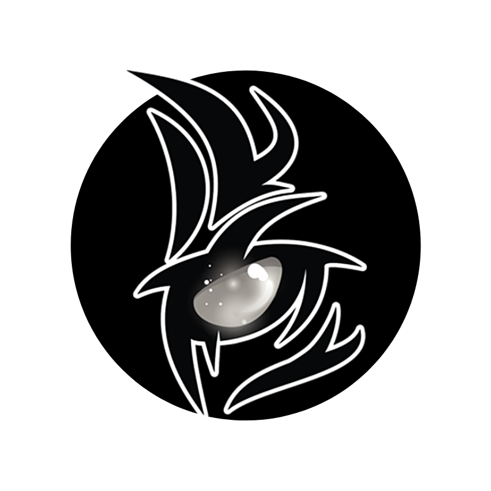

<p align="center">
  <a href="https://github.com/eluvju">
    
  </a>

  <p align="center">
    Feel free to enjoy my github. <a href="https://www.instagram.com/vpokbr/">@Vpokbr </a></figcaption>
    <br />
    <a href="https://discord.gg/r6WMs3M4">Discord</a>
  </p>

Please ```Follow for More Content``` this repository to increase the awareness of the project for others to use or add to.

## List of Projects
* [Porfolio Web](#portfolio)
* [Python](#python)
* [C++](#c++)

## Python 

Project | Client | Niche
------|------|------|------
<a href="https://eluvju.github.io/mockup-clinic">Cortico Clinic </a> | Upwwork | Template/Mockup
<a href="https://ellamaisbella.xyz">Ella mais Bella </a> | Ligia | E-Commerce Wordpress

## Python 

Project | Features | Note
------|------|------|------
<a href="https://github.com/eluvju/beecrowd">Python Challengers </a> | Beecrowd Solutions | Tournament
<a href="https://github.com/eluvju/Whatsapp_Group_Manager">Whatsapp Group Manager </a> | Create groups, Add contacts and other stuffs | Selenium


## C++ 

Project | Status | Note
------|------|------
<a href="https://github.com/eluvju/dattebayo">Ragnaruto Server </a> | ```Paused``` | Based on ragnarok, this is a custom server of Naruto


